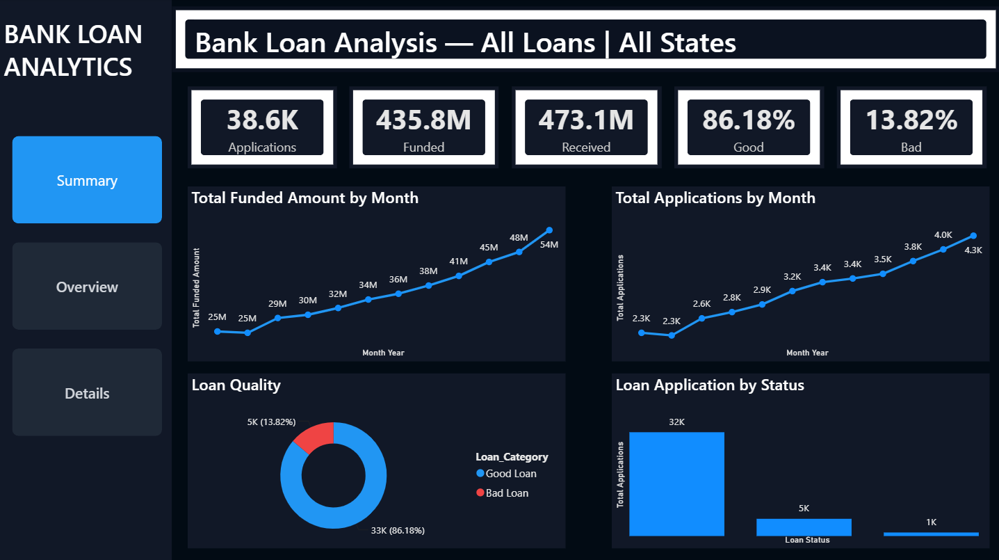
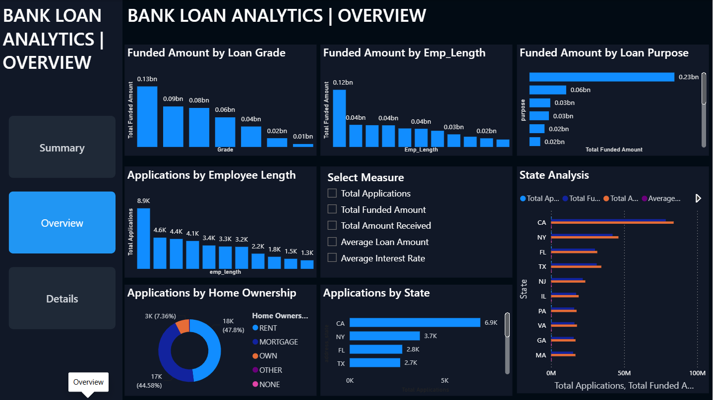
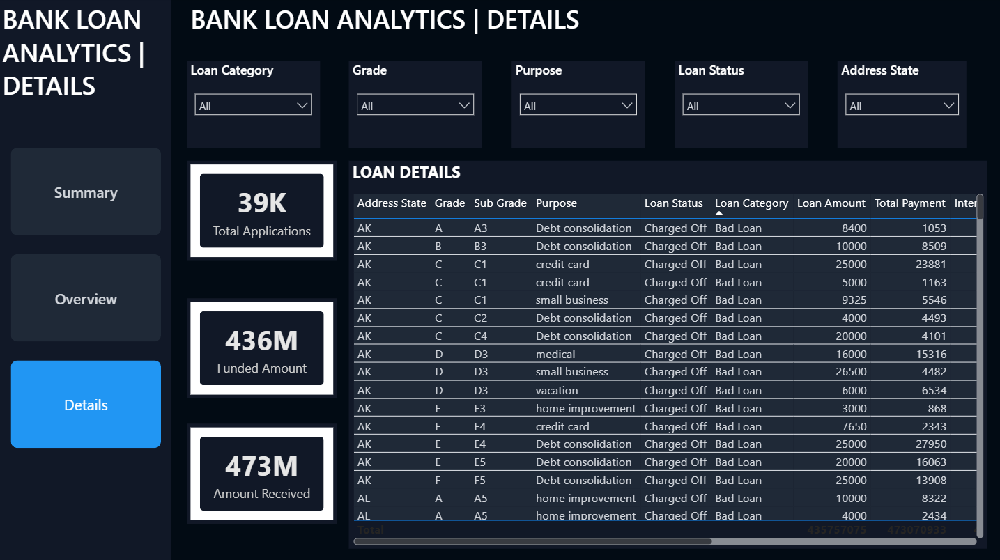

# 🏦 Bank Loan Analysis | Power BI Dashboard

## 📌 Project Overview

This project features an interactive **Bank Loan Analysis Dashboard** developed using **Microsoft Power BI**. The dashboard provides a comprehensive view of loan applications, funded amounts, repayments, loan quality, customer profiles, and regional trends.

It enables users to explore financial loan data through interactive visualizations, KPIs, filters, and detailed loan-level analysis.

---

## 🎯 Project Objective

The primary objective of this project is to analyze bank loan data and generate meaningful insights into:

* Loan application performance
* Funded and received loan amounts
* Good vs. Bad loan performance
* Monthly loan trends
* Loan grades and purposes
* Customer and employment characteristics
* Home ownership patterns
* State-wise loan activity
* Individual loan-level details

---

## 📊 Key Performance Indicators

The dashboard tracks important financial and operational KPIs, including:

* **Total Loan Applications**
* **Total Funded Amount**
* **Total Amount Received**
* **Average Loan Amount**
* **Average Interest Rate**
* **Good Loan Applications**
* **Bad Loan Applications**

---

## 📑 Dashboard Pages

### 1️⃣ Summary Dashboard

Provides a high-level overview of the overall loan portfolio through:

* KPI cards
* Monthly loan application trends
* Monthly funded amount trends
* Loan quality analysis
* Loan status distribution
* Overall portfolio performance

### 2️⃣ Overview Dashboard

Provides deeper insights into different dimensions of the loan portfolio, including:

* Loan grade analysis
* Loan purpose analysis
* Employment length
* Home ownership
* State-wise loan performance
* Dynamic measure analysis
* Interactive data exploration

### 3️⃣ Details Dashboard

Provides detailed loan-level information with interactive filtering options such as:

* Loan category
* State
* Loan grade
* Loan purpose
* Loan status
* Detailed loan records

---

## 🛠️ Tools & Technologies

* **Microsoft Power BI**
* **Power Query**
* **DAX**
* **Data Cleaning & Transformation**
* **Data Analysis**
* **Data Visualization**

---

## 💡 Key Features

* 📊 Interactive dashboard navigation
* 🔢 Dynamic KPI cards
* 📈 Time-series analysis
* 🎛️ Interactive slicers and filters
* 🔄 Dynamic measure selection
* 🗺️ State-wise loan analysis
* ✅ Good vs. Bad loan classification
* 📋 Detailed loan-level analysis
* 📉 Loan status and quality analysis
* 🎯 Interactive data exploration

---

## 📂 Repository Contents

| File                      | Description                   |
| ------------------------- | ----------------------------- |
| `Bank Loan Analysis.pbix` | Power BI dashboard file       |
| `Summary.png`             | Summary dashboard preview     |
| `Overview.png`            | Overview dashboard preview    |
| `Details.png`             | Details dashboard preview     |
| `financial_loan.csv`      | Dataset used for the analysis |
| `README.md`               | Project documentation         |

---

## 📸 Dashboard Preview

### Summary Dashboard

### Overview Dashboard

### Details Dashboard

---

## 📌 Project Outcome

The dashboard transforms raw bank loan data into an interactive analytical solution, making it easier to identify **loan trends, p**
